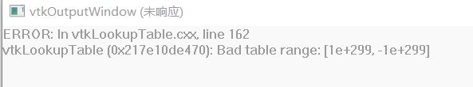

# FLuent ansys 解析器
## V21
### cas
这部分代表网格结构
/settings/Origin 版本名
/settings/Version 版本号
/meshes/1/nodes/coords 所有节点坐标
/meshes/1/faces/zoneTopology/name zone名称数据 以;分割
/meshes/1/faces/c1/
3、提取/meshes/1/faces/zoneTopology/name zone名称 以;分割为数组。/meshes/1/faces/nodes/1/nnodes值每个点对应名称数组的索引，需要根据任意名称访问对应拓扑和数据的方法 4、可将指定拓扑数据按node节点索引保存，也可将保存的有node索引数据重新复写到拓扑中，如果数据集没有对应数据，则增加对应子树

---------------------------
FluentCFFZoneViewer.manual.exe - 系统错误
---------------------------
由于找不到 hdf5.dll，无法继续执行代码。重新安装程序可能会解决此问题。 
---------------------------
确定   
---------------------------
---------------------------
FluentCFFZoneViewer.manual.exe - 无法找到入口
---------------------------
无法定位程序输入点 _Z13comparesEqualRK21QPersistentModelIndexS1_ 于动态链接库 C:\tools\msys64\mingw64\bin\libvtkGUISupportQt.dll 上。 
---------------------------
确定   
---------------------------
& 'F:\Users\20968\projects\ai\gnn\examples\FluentCFFZoneViewer\build-msys2-clang\FluentCFFZoneViewer.manual.exe'